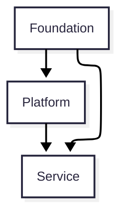
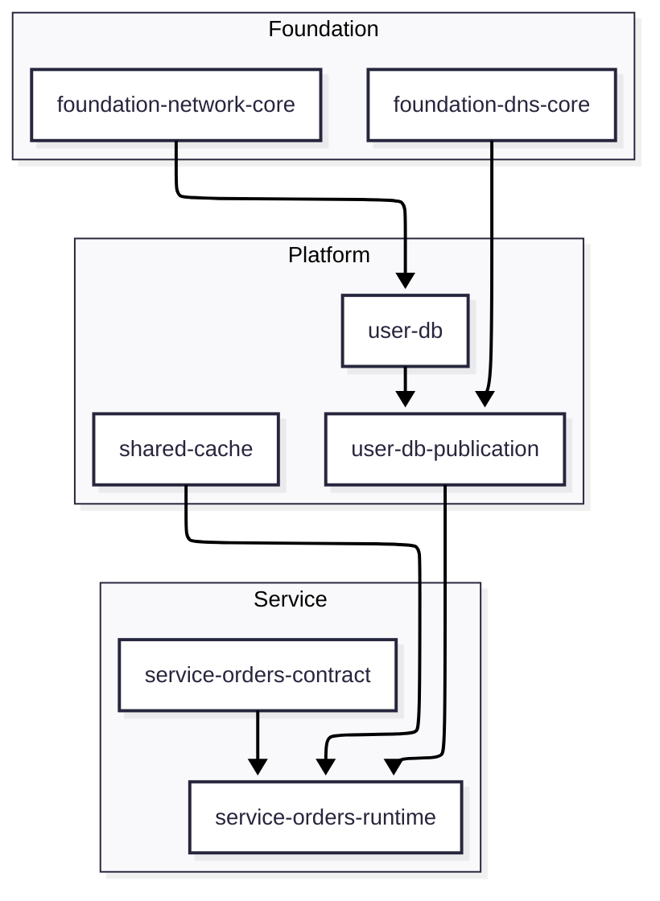

# Overview

## Purpose

This document defines the architecture rules for operating Terraform-based infrastructure with three layers: `Foundation`, `Platform`, and `Service`.

Its main goals are:

- clarify ownership and responsibility for each layer
- keep dependency direction explicit and predictable
- connect layers through Contracts rather than direct implementation references
- define when a Workspace should be split
- organize a stable operating model for shared resources

## Scope

Included in scope:

- AWS infrastructure managed by Terraform
- shared infrastructure and service-specific infrastructure
- value publication and reference rules between layers
- Workspace design principles

Out of scope:

- application-internal implementation details
- deployment pipeline details
- low-level module implementation per resource

## Non-goals

This document does not aim to:

- rename all existing assets immediately
- promote every shared resource to `Platform` by default
- force a 1:1 mapping between Layer and Workspace
- broadly allow direct cross-layer references for implementation convenience

## Audience

- engineers designing Terraform Workspaces
- platform engineers operating shared infrastructure
- service teams designing or consuming service infrastructure

## Start with the pictures

For a first read, the two key questions are "what may depend on what?" and "how is a Workspace different from a Layer?" It is better to establish those first before diving into detailed terminology.

### Layer view

This view shows the allowed dependency direction. Lower layers may consume published Contracts from upper layers, but they must not reach into implementation details.

### Workspace view

This view makes the Layer and Workspace distinction concrete. A shared capability may keep ownership in one domain while publishing Contracts from a separate publication Workspace.

## Design principles

- A Layer is an ownership model.
- Dependency direction must remain explicit.
- Lower layers consume Contracts, not implementation details.
- Contract ownership belongs to the provider.
- A Workspace is an operating boundary, not the same thing as a Layer.
- Shared resources should stay stable even when consumer count grows.

In smaller environments, `core`, `binding`, and `publication` can remain in one Workspace. Split them only when change churn, risk, or operational ownership diverges.

## Recommended reading order

For a first pass, read in this order:

1. [Layers](./02-layers.md)
2. [Contracts](./03-contracts.md)
3. [Ownership and References](./04-ownership-and-references.md)
4. [Workspace Model](./05-workspace-model.md)
5. [Operations](./08-operations.md)
6. [Safety and Resilience](./09-safety-and-resilience.md)

Use [Reference Terms](./01a-glossary-and-views.md) only when you need a term lookup.
