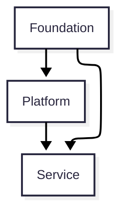
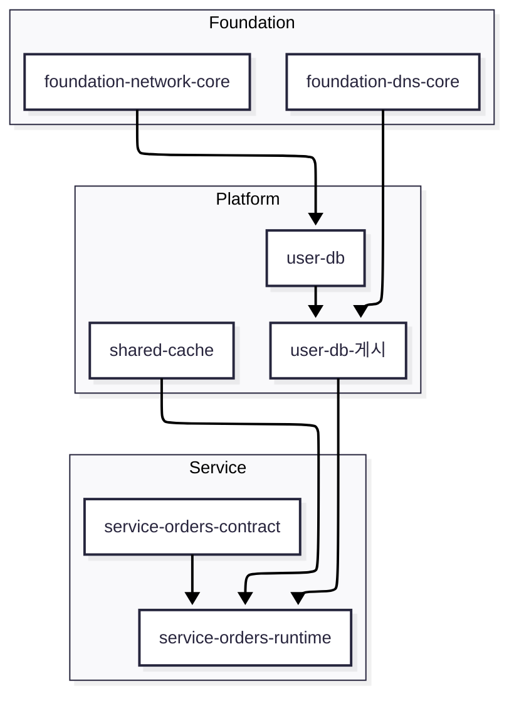

---
title: 개요
doc_section: architecture
nav_parent: architecture-index
nav_order: 2
---

# 개요

## 목적

이 문서는 Terraform 기반 인프라를 `Foundation`, `Platform`, `Service`의 3개 레이어로 설계하고 운영하기 위한 아키텍처 기준을 정의합니다.

주요 목표는 다음과 같습니다.

- 레이어별 책임과 ownership 명확화
- 레이어 간 의존 방향 통제
- 계약 중심 연결 방식 표준화
- 워크스페이스 분리 원칙 정의
- 공유 리소스 운영 모델 정리

## 범위

포함 대상:

- Terraform으로 관리되는 AWS 인프라
- shared infrastructure와 service-specific infrastructure
- 레이어 간 전달값과 참조 모델
- Terraform 워크스페이스 설계 원칙

비포함 대상:

- 애플리케이션 내부 구현
- 배포 파이프라인 상세 절차
- 모듈 내부 세부 구현

## 비목표

- 기존 운영 자산의 이름과 경로를 즉시 전면 변경하는 일
- 모든 공유 리소스를 무조건 Platform으로 승격하는 일
- Layer와 워크스페이스를 1:1로 강제하는 일
- 구현 편의를 위해 레이어 간 직접 참조를 폭넓게 허용하는 일

## 대상 독자

- Terraform workspace를 설계하는 엔지니어
- shared infrastructure를 운영하는 플랫폼 엔지니어
- 서비스 인프라를 설계하거나 소비하는 서비스 개발팀

## 먼저 봐야 할 그림

처음 읽는 사람은 세부 용어보다 먼저 "무엇이 누구를 참조할 수 있는가"와 "Layer와 워크스페이스가 왜 다른가"를 잡는 편이 훨씬 이해가 빠릅니다.

### Layer 구조 뷰

이 다이어그램은 허용된 참조 방향을 보여줍니다. 아래 레이어는 위 레이어가 게시한 계약을 소비할 수 있지만, 구현 세부사항을 직접 참조해서는 안 됩니다.

### 워크스페이스 구조 뷰

이 뷰는 Layer와 워크스페이스가 같은 개념이 아님을 보여줍니다. 하나의 공유 capability는 ownership은 유지한 채 게시 워크스페이스를 별도로 둘 수 있습니다.

## 설계 원칙

- Layer는 ownership 모델이다.
- Dependency는 단방향이어야 한다.
- 하위 레이어는 계약만 소비한다.
- 계약 ownership은 Provider에게 있다.
- 워크스페이스는 운영 단위다.
- 공유 리소스는 필요 시 분리할 수 있는 구조여야 한다.

작은 규모에서는 core, access, 게시를 하나의 워크스페이스에서 함께 운영할 수 있습니다. 다만 변경 churn과 영향 범위가 커질 때 분리할 수 있어야 합니다.

## 권장 읽기 순서

처음 읽는 기준으로는 아래 순서를 권장합니다.

1. [계층](./02-layers.md)
2. [계약](./03-contracts.md)
3. [소유권과 참조](./04-ownership-and-references.md)
4. [워크스페이스 모델](./05-workspace-model.md)
5. [운영](./08-operations.md)
6. [안전성과 복원력](./09-safety-and-resilience.md)

용어가 필요할 때만 [용어 참고](./01a-glossary-and-views.md)를 옆에서 찾아보면 충분합니다.

