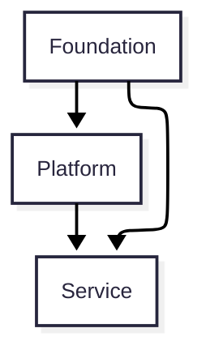
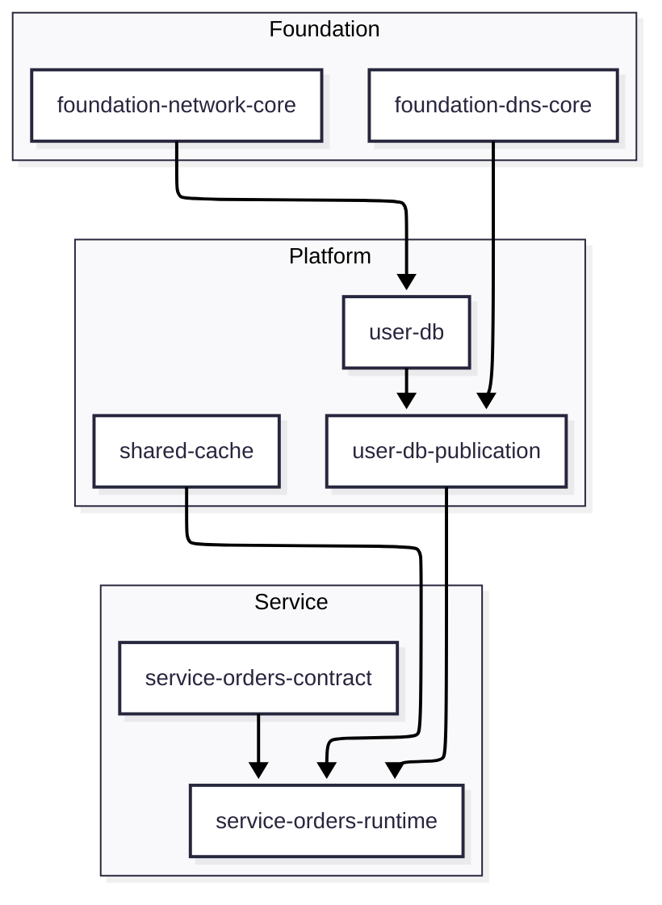

# Glossary and Views

## Glossary

| Term | Meaning |
| --- | --- |
| Layer | Logical model that defines ownership and dependency direction |
| Workspace | Operational unit that controls Terraform state, apply scope, permissions, and blast radius |
| Resource Set | Group of resources that provides one shared capability |
| Provider | Owner that publishes a Contract and guarantees its meaning |
| Consumer | Component that reads or uses a Contract |
| Contract | Officially published value or interface allowed for cross-layer consumption |
| Implementation Value | Internal detail that should not be consumed directly |
| Contract Value | Stable value that consumers are allowed to depend on |
| Primary Resource | Main resource body of a shared capability |
| Binding | Allowlist, grant, policy, or other access-control attachment |
| Publication | Surface that publishes a consumer-facing Contract |
| Source of Truth | System or owner responsible for the meaning and lifecycle of a value |
| Blast Radius | Scope affected by a change or failure |

## Layer view

This view shows the allowed dependency direction. Higher-level capabilities may be consumed downward, but lower layers must not reach back into implementation details of upper layers.

## Workspace view

This view illustrates that Layer and Workspace are related but not identical concepts. A shared capability may publish Contracts from a dedicated publication Workspace without changing ownership.

## Next

- [Layers](./02-layers.md)
