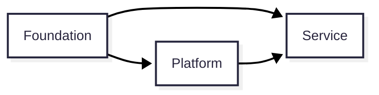
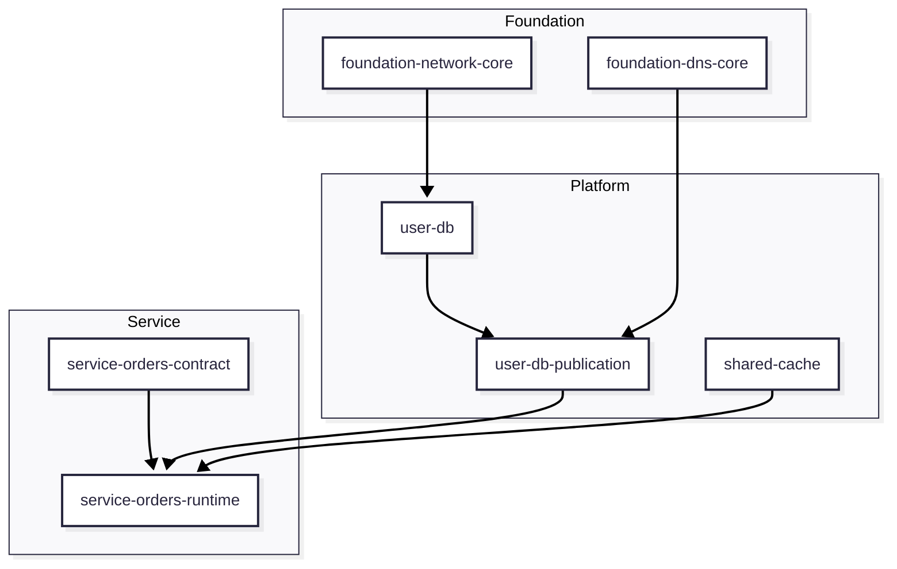

# Glossary and Views

## 용어집

| 용어 | 의미 |
| --- | --- |
| Layer | ownership과 dependency를 정의하는 논리 구조 |
| Workspace | Terraform state, apply, 권한, blast radius를 제어하는 운영 단위 |
| Resource Set | 하나의 shared capability를 제공하는 리소스 묶음 |
| Provider | Contract를 제공하고 의미와 안정성을 보장하는 주체 |
| Consumer | Contract를 읽고 사용하는 주체 |
| Contract | 하위 레이어가 소비하기 위해 공식적으로 게시한 값 또는 인터페이스 |
| Implementation Value | 내부 구현 세부사항으로 직접 소비하면 안 되는 값 |
| Contract Value | consumer가 소비해도 되는 안정된 값 |
| Primary Resource | shared capability의 본체 리소스 |
| Binding | allowlist, grant, binding, policy 같은 접근 제어 구성 |
| Publication | consumer-facing contract를 게시하는 구성 |
| Source of Truth | 값의 의미와 생성 책임이 존재하는 원천 |
| Blast Radius | 변경 또는 실패가 영향을 미치는 범위 |

## 시스템 뷰

이 다이어그램은 참조 가능한 방향을 표현합니다.

## Workspace 관점 뷰

이 뷰는 Layer와 Workspace가 같은 개념이 아니라는 점을 보여줍니다.

## 다음 문서

- [Layers](./02-layers.md)

