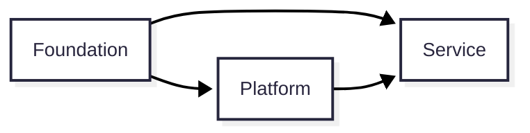
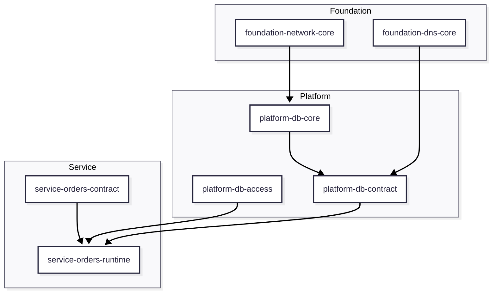

# Glossary and Views

## 용어집

| 용어 | 의미 |
| --- | --- |
| Layer | ownership과 dependency를 정의하는 논리적 구조 |
| Workspace | Terraform state, apply, 권한, blast radius를 제어하는 운영 단위 |
| Provider | Contract를 제공하고 의미를 보장하는 주체 |
| Consumer | Contract를 읽거나 사용하는 주체 |
| Contract | 레이어 간 의존을 위해 공식적으로 게시된 값 또는 인터페이스 |
| Implementation Value | 내부 구현 세부사항으로 직접 의존하면 안 되는 값 |
| Contract Value | consumer가 의존해도 되는 안정된 값 |
| Core | shared resource의 본체 리소스 |
| Access | allowlist, grant, binding, policy 같은 접근 제어 영역 |
| Publication | consumer-facing contract를 게시하는 영역 |
| Source of Truth | 값의 의미와 실제 생성 책임이 존재하는 원천 |
| Blast Radius | 변경 또는 실패가 영향을 미치는 범위 |

## 시스템 뷰

이 다이어그램은 참조 가능한 방향을 표현합니다.

## Workspace 관점 뷰

이 뷰는 Layer와 Workspace가 동일 개념이 아니라는 점을 보여줍니다.

## 다음 문서

- [Layers](./02-layers.md)
