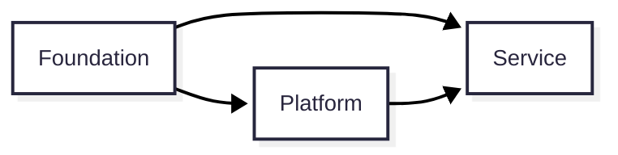
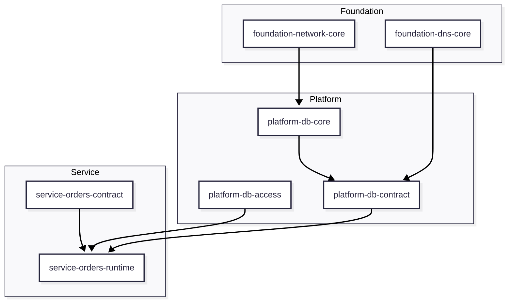

# Terraform 3-Layer Architecture Technical Specification

## 1. 문서 개요

### 1.1 목적

이 문서는 Terraform 기반 인프라를 `Foundation`, `Platform`, `Service`의 3개 레이어로 설계하고 운영하기 위한 아키텍처 기준을 정의합니다.

본 문서는 다음을 명확히 합니다.

- 레이어별 책임과 ownership
- 레이어 간 의존 방향
- Contract 중심의 연결 방식
- Workspace 분리 원칙
- shared resource 운영 모델

### 1.2 범위

이 문서는 다음 대상을 포함합니다.

- Terraform으로 관리되는 AWS 인프라
- shared infrastructure와 service-specific infrastructure
- 레이어 간 전달값과 참조 모델
- Terraform Workspace 설계 원칙

이 문서는 애플리케이션 내부 구현, 배포 파이프라인 상세 절차, 리소스별 세부 모듈 구현까지는 다루지 않습니다.

### 1.3 비목표

이 문서는 다음을 직접 목표로 하지 않습니다.

- 기존 운영 자산의 이름과 경로를 즉시 전면 변경하는 일
- 모든 shared resource를 무조건 Platform으로 승격하는 일
- Layer와 Workspace를 1:1로 강제하는 일
- 구현 편의를 위해 레이어 간 직접 참조를 폭넓게 허용하는 일

### 1.4 대상 독자

- Terraform workspace를 설계하는 엔지니어
- shared infrastructure를 운영하는 플랫폼 엔지니어
- 서비스 인프라를 설계하거나 소비하는 서비스 개발팀

### 1.5 읽는 방법

이 문서는 아래 순서로 읽는 것을 권장합니다.

1. 문서 개요와 설계 원칙
2. Layer 정의
3. Contract 모델
4. Ownership 및 참조 규칙
5. Workspace 모델
6. Shared resource 운영 모델
7. 안전성 구조
8. 결정 체크리스트

빠르게 판단이 필요한 경우에는 `11. 안전성 구조`와 `12. 아키텍처 결정 체크리스트`를 먼저 읽어도 됩니다.

## 2. 용어집

| 용어 | 의미 |
| --- | --- |
| Layer | ownership과 dependency를 정의하는 논리적 구조 |
| Workspace | Terraform state, apply, 권한, blast radius를 제어하는 운영 단위 |
| Provider | Contract를 제공하고 의미를 보장하는 주체 |
| Consumer | Contract를 읽거나 사용하는 주체 |
| Contract | 레이어 간 의존을 위해 공식적으로 게시된 값 또는 인터페이스 |
| Implementation Value | 내부 구현 세부사항으로 직접 의존하면 안 되는 값 |
| Contract Value | consumer가 의존해도 되는 안정된 값 |
| Core | shared resource의 본체 리소스 |
| Access | allowlist, grant, binding, policy 같은 접근 제어 영역 |
| Publication | consumer-facing contract를 게시하는 영역 |
| Source of Truth | 값의 의미와 실제 생성 책임이 존재하는 원천 |
| Blast Radius | 변경 또는 실패가 영향을 미치는 범위 |

## 3. 설계 원칙

### 3.1 Layer는 ownership 모델이다

Layer는 폴더 구조나 코드 배치 규칙이 아니라 리소스와 인터페이스의 ownership을 정의하는 논리적 모델입니다.

### 3.2 Dependency는 단방향이어야 한다

레이어 간 참조는 단방향이어야 하며 순환 의존을 허용하지 않습니다.

### 3.3 하위 레이어는 Contract만 소비한다

하위 레이어는 상위 레이어의 implementation value를 직접 참조하지 않고, 상위 레이어가 게시한 Contract만 사용해야 합니다.

### 3.4 Contract ownership은 provider에게 있다

Contract의 owner는 값을 읽는 consumer가 아니라, 해당 값을 제공하고 의미와 안정성을 보장하는 provider입니다.

### 3.5 Workspace는 운영 단위다

Workspace는 state, apply, 권한, 변경 전파 범위, blast radius를 제어하기 위한 운영 단위입니다. Layer와 Workspace는 동일 개념이 아닙니다.

### 3.6 shared resource는 분리 가능한 구조여야 한다

shared resource는 필요 시 다음 세 영역으로 분리할 수 있어야 합니다.

- Core
- Access
- Publication

중요한 점은 이것이 항상 별도 Workspace여야 한다는 뜻은 아니라는 것입니다. 초기 규모가 작고 lifecycle, 변경 주기, 운영 주체가 같다면 하나의 Workspace로 함께 관리할 수 있습니다. 다만 변경 churn과 blast radius가 커질 때 분리할 수 있는 구조여야 합니다.

## 4. 아키텍처 모델

### 4.1 시스템 뷰

위 다이어그램은 "참조 가능한 방향"을 표현합니다. 의미상으로는 하위 레이어가 상위 레이어가 게시한 Contract를 소비하는 구조입니다.

### 4.2 Layer 개요

| Layer | 역할 | 주된 책임 | 참조 가능 대상 |
| --- | --- | --- | --- |
| Foundation | 기반 인프라 제공 | 네트워크, 전역 기반 자원, 공통 토대 | 없음 |
| Platform | shared capability 제공 | 공유 런타임, 공유 데이터, 공용 인터페이스 | Foundation |
| Service | 서비스 제공 | 서비스별 배포, 설정, 권한, 엔드포인트 | Foundation, Platform |

### 4.3 Layer dependency 방향

논리적 의존 방향은 아래와 같습니다.

`Foundation <- Platform <- Service`

참조 허용 방향을 실행 관점으로 쓰면 아래와 같습니다.

- Platform은 Foundation을 참조할 수 있다.
- Service는 Foundation과 Platform을 참조할 수 있다.
- Foundation은 Platform 또는 Service를 참조하지 않는다.
- Platform은 Service의 내부 구현값을 참조하지 않는다.

### 4.4 Workspace 관점 뷰

이 뷰는 Layer와 Workspace가 같은 개념이 아니라는 점을 보여주기 위한 예시입니다. 하나의 Layer 안에서도 Core / Access / Contract / Runtime으로 분리될 수 있습니다.

## 5. Layer 정의

### 5.1 Foundation Layer

Foundation Layer는 환경의 기반이 되는 공통 인프라를 관리합니다.

주요 책임:

- 네트워크와 전역 공통 기반 제공
- 환경 초기 구성
- 변경 빈도가 낮고 다수 consumer가 의존하는 기반 자원 관리

대표 리소스:

- VPC / Subnet
- Route Table / NAT / IGW
- Route53 Hosted Zone
- 공용 KMS Key
- 공용 NACL

판단 기준:

- 여러 상위 레이어가 넓게 참조한다.
- 자주 변경되지 않는다.
- 특정 서비스 lifecycle에 종속되지 않는다.

### 5.2 Platform Layer

Platform Layer는 여러 서비스가 공통으로 사용하는 shared capability를 제공합니다.

주요 책임:

- shared runtime 제공
- shared data service 제공
- shared ingress, DNS, storage, cluster 같은 공용 인터페이스 제공

대표 리소스:

- ECS / EKS Cluster
- Shared ALB / NLB
- RDS / ElastiCache / Kafka
- Shared S3 / ECR / Log Group
- internal shared DNS endpoint

판단 기준:

- 여러 서비스가 공통으로 소비한다.
- provider로서 안정된 Contract를 게시한다.
- 서비스 개별 구현 세부사항을 일반 리소스 관리 목적으로 알지 않아야 한다.

예외:

- producer-side access control을 위한 최소 식별자(Client SG, Role ARN, principal)는 참조할 수 있다.

### 5.3 Service Layer

Service Layer는 개별 서비스 lifecycle과 함께 움직이는 리소스를 관리합니다.

주요 책임:

- 서비스 배포와 운영
- 서비스 전용 설정과 권한 관리
- 서비스 전용 endpoint와 runtime dependency 연결

대표 리소스:

- ECS Service / Lambda / application stack
- service-specific S3
- service-specific Route53 Record
- service-specific Secret / Parameter
- service IAM Role / Security Group / ALB

판단 기준:

- 특정 서비스 lifecycle과 함께 변경된다.
- 다른 서비스에 대한 일반 shared capability가 아니다.
- 독립 배포와 독립 롤백이 중요하다.

## 6. Contract 모델

### 6.1 Contract 정의

Contract는 레이어 간 의존성을 표현하기 위해 공식적으로 게시된 값 또는 인터페이스입니다.

예:

- Terraform output
- SSM Parameter
- Route53 Record
- Secret reference
- IAM principal reference
- Security Group client identity
- stable bucket name, cluster name, key ARN

Contract는 단순한 값 목록이 아니라 아래 성질을 가져야 합니다.

- consumer가 구현 세부사항을 몰라도 사용할 수 있어야 한다.
- 의미가 문서화되어 있어야 한다.
- provider가 안정성과 변경 정책을 설명할 수 있어야 한다.
- breaking change 여부를 판단할 수 있어야 한다.

즉, 어떤 값이 외부에 노출되었다고 해서 자동으로 Contract가 되는 것은 아닙니다. provider가 공식 surface로 관리하는 값만 Contract로 취급합니다.

### 6.2 Implementation Value와 Contract Value

| 구분 | 의미 | 하위 레이어 직접 참조 여부 |
| --- | --- | --- |
| Implementation Value | 내부 구현 세부사항 | 금지 |
| Contract Value | 안정적으로 게시된 공식 값 | 허용 |

Implementation Value 예:

- RDS가 직접 생성한 endpoint
- ALB physical name
- 내부 리소스 ID

Contract Value 예:

- stable DNS name
- 표준 SSM parameter path
- 공식 output name
- stable bucket name

판단 질문:

- 이 값은 내부 구현이 바뀌어도 유지되어야 하는가
- 하위 레이어가 이 값에 의존해도 provider가 책임질 수 있는가
- 문서와 운영 절차에 따라 변경 관리가 가능한가

위 질문에 그렇다고 답하기 어렵다면 Implementation Value일 가능성이 큽니다.

### 6.3 Contract 유형

#### Identity Contract

리소스를 안정적으로 식별하기 위한 계약값입니다.

예:

- VPC ID
- Hosted Zone ID
- Cluster Name
- Bucket Name
- KMS Key ARN

#### Connectivity Contract

접속을 위한 안정된 계약값입니다.

예:

- DB stable DNS
- Redis stable DNS
- shared ingress hostname
- internal API hostname

#### Access Contract

접근 허용을 위한 식별자 또는 허용 기준입니다.

예:

- Client SG
- IAM principal ARN
- IRSA Role ARN
- consumer principal

#### Runtime Contract

애플리케이션 또는 운영 시스템이 runtime에 조회하는 계약값입니다.

예:

- SSM parameter
- Secret reference
- queue URL
- topic name

### 6.4 Contract publication 모델

Contract는 다음 두 요소가 합쳐져야 성립합니다.

1. 의미를 정의하는 provider
2. 값을 전달하는 publication surface

publication surface 예:

- Terraform output
- SSM parameter
- Route53 record
- Secrets Manager reference
- output aggregation

중요한 점은 publication surface가 ownership을 결정하지 않는다는 것입니다. 예를 들어 SSM에 저장되었더라도 그 값이 Platform이 제공하는 DB endpoint contract라면 owner는 Platform입니다.

### 6.5 Contract owner와 consumer의 책임

#### Provider 책임

- Contract 의미 정의
- naming과 path 안정성 관리
- 변경 호환성 보장
- deprecation 및 migration 계획 제공
- consumer가 기대할 수 있는 semantics 문서화

#### Consumer 책임

- Contract만 의존하고 implementation을 추측하지 않기
- deprecated signal에 맞춰 migration 수행
- 비공식 값이나 임시 output에 의존하지 않기

### 6.6 Contract 최소 기술 항목

아키텍처 문서 또는 module 문서에 Contract를 명시할 때 최소한 아래 항목을 포함합니다.

| 항목 | 설명 |
| --- | --- |
| Name | Contract 이름 |
| Type | Identity / Connectivity / Access / Runtime |
| Provider | Contract owner |
| Consumer | 예상 consumer 또는 consumer class |
| Publication | Terraform output / SSM / DNS 등 전달 수단 |
| Stability | stable / versioned / temporary |
| Breaking Change Policy | 변경 시 절차 |
| Source of Truth | 실제 값을 생성하는 시스템 또는 workspace |

### 6.7 Contract source of truth

publication workspace나 aggregation workspace가 존재하더라도 source of truth는 원 provider에 남아 있어야 합니다.

예:

- DB endpoint contract의 source of truth는 DB를 운영하는 Platform domain
- DNS publication은 contract 전달 수단일 뿐 ownership 이전이 아님
- aggregation output은 convenience layer일 수 있지만 contract 의미를 새로 정의하지는 않음

### 6.8 Contract compatibility 원칙

다음 변화는 일반적으로 breaking change로 취급합니다.

- contract name 변경
- parameter path 변경
- DNS name 변경
- 값의 의미 변경
- consumer가 기대하는 format 변경
- access contract의 scope 축소

다음 변화는 non-breaking일 수 있습니다.

- implementation 교체 후 contract value 유지
- publication backend의 내부 구조 변경
- consumer에게 투명한 내부 리소스 교체

breaking 여부는 "consumer 수정이 필요한가"와 "기존 의미가 유지되는가"를 기준으로 판단합니다.

### 6.9 Contract ownership

Contract ownership은 다음으로 결정하지 않습니다.

- 누가 읽는가
- 어디에 저장되는가
- 어떤 도구로 전달되는가

Contract ownership은 아래 기준으로 결정합니다.

- 누가 해당 리소스 또는 인터페이스를 제공하는가
- 누가 그 의미를 정의하는가
- 누가 안정성과 호환성을 보장하는가

예:

- `db-main.internal.example.com`을 backend가 읽더라도 owner는 backend가 아니라 DB provider다.
- SSM parameter에 저장된 secret reference를 서비스가 소비하더라도, secret 의미와 rotation을 Platform이 관리하면 owner는 Platform이다.
- Hosted Zone이 Foundation에 있어도 개별 record contract의 owner는 Platform 또는 Service일 수 있다.

### 6.10 Contract lifecycle

Contract 상태는 다음 네 가지로 관리합니다.

- Draft
- Active
- Deprecated
- Removed

운영 원칙:

- Active Contract는 in-place rename 하지 않는다.
- Active Contract의 의미를 조용히 바꾸지 않는다.
- breaking change가 필요하면 새 Contract를 추가하고 migration을 수행한다.
- Deprecated 없이 바로 제거하지 않는다.

권장 상태 전이:

`Draft -> Active -> Deprecated -> Removed`

운영 가이드:

- Draft는 실험적이거나 공식 consumer가 없는 상태다.
- Active는 문서화되어 있고 운영 의존성이 존재하는 상태다.
- Deprecated는 신규 사용을 금지하지만 기존 consumer는 유지하는 상태다.
- Removed는 모든 consumer migration 완료 후 제거된 상태다.

### 6.11 Contract 사례

#### 사례 1. DB endpoint

- 실제 DB instance endpoint: Implementation Value
- `db-main.internal.example.com`: Connectivity Contract
- `/platform/db/main/host`: Runtime Contract

backend 서비스는 위 둘 중 provider가 공식화한 Contract만 사용해야 하며, 직접 RDS endpoint를 참조하지 않습니다.

#### 사례 2. shared bucket

- bucket physical ID: Implementation Value일 수 있음
- stable bucket name: Identity Contract
- bucket consumer principal binding: Access Contract

#### 사례 3. service API

- internal ALB DNS: Implementation Value
- `orders-api.internal.example.com`: Service가 제공하는 Connectivity Contract

## 7. Ownership 및 참조 규칙

### 7.1 리소스 ownership 판단 기준

리소스 ownership은 배치 편의가 아니라 lifecycle과 운영 책임을 기준으로 판단합니다.

owner의 책임:

- 생성
- 변경
- 삭제
- 정책 관리
- 인터페이스 안정성 관리
- 호환성 관리

### 7.2 허용되는 참조

- Service → Platform Contract
- Service → Foundation Contract
- Platform → Foundation Contract
- producer-side access control을 위한 최소 식별자 참조

### 7.3 금지되는 참조

- Foundation → Platform 또는 Service 참조
- Platform → Service 내부 구현 참조
- Service A → Service B 내부 구현 참조
- 순환 참조

### 7.4 예외: access control

다음은 제한적으로 허용합니다.

- SG ingress allowlist
- bucket policy binding
- KMS grant / key policy binding
- role trust policy consumer binding

단, core lifecycle과 access lifecycle은 가능하면 분리합니다.

### 7.5 참조 시 금지되는 설계 습관

- 하위 레이어가 상위 레이어의 물리 리소스명을 직접 조합해 쓰는 것
- consumer가 provider contract를 우회해 내부 output을 직접 읽는 것
- temporary migration output을 영구 인터페이스처럼 사용하는 것
- shared resource onboarding 때문에 core workspace를 계속 수정하는 것

## 8. Workspace 모델

### 8.1 Workspace 정의

Workspace는 Terraform state, apply, 권한 경계, blast radius를 가지는 운영 단위입니다.

정리:

- Layer = ownership / dependency 모델
- Workspace = state / apply / blast radius 모델

### 8.2 Workspace 유형

#### Core Workspace

핵심 리소스 본체를 관리합니다.

예:

- VPC
- Cluster
- RDS
- Shared S3
- KMS Key

특성:

- 변경 빈도 낮음
- blast radius 큼
- 안정성 우선

#### Access Workspace

접근 허용과 binding을 관리합니다.

예:

- SG ingress allowlist
- bucket policy attachment
- KMS grants
- consumer binding

특성:

- 변경 빈도 높음
- onboarding / offboarding이 잦음
- core와 분리 가치가 큼

#### Publication Workspace

하위 레이어가 사용할 Contract를 게시합니다.

예:

- SSM parameter publication
- Route53 stable endpoint publication
- output aggregation

특성:

- consumer-facing surface를 담당
- source of truth와 분리될 수 있음
- ownership 자체를 가져가지는 않음

#### Service Runtime Workspace

개별 서비스의 배포 단위를 관리합니다.

예:

- ECS Service
- Lambda stack
- service IAM / SG
- service-specific DNS

### 8.3 Workspace 분리 기준

다음 조건을 만족하면 같은 Workspace에 둘 수 있습니다.

- 항상 함께 변경된다.
- lifecycle이 동일하다.
- ownership이 동일하다.
- blast radius 차이가 크지 않다.
- 운영 주체와 리뷰 주체가 사실상 같다.

예를 들어 하나의 shared resource에 대해 core, access, publication이 모두 같은 팀에 의해 함께 관리되고, consumer 수도 적고, access 변경도 드물다면 하나의 Workspace로 관리할 수 있습니다.

예:

- 하나의 DB 클러스터에 대해 DB core, SG allowlist, SSM publication을 함께 관리
- 하나의 shared bucket에 대해 bucket, policy binding, output publication을 함께 관리
- 하나의 Redis에 대해 core, ingress allowlist, endpoint publication을 함께 관리

다음 조건이 강하면 분리를 우선 검토합니다.

- 변경 빈도가 다르다.
- apply 주체가 다르다.
- rollback 위험이 다르다.
- downstream dependency가 많다.
- core와 access가 섞여 있다.
- 서비스 온보딩이나 access rule 변경이 잦다.
- publication contract를 별도 migration해야 할 가능성이 크다.

### 8.4 Workspace와 Contract의 관계

Workspace는 Contract를 게시할 수 있지만 Contract owner와 항상 동일하지는 않습니다.

예:

- `platform-db-core`가 DB를 생성한다.
- `platform-db-contract`가 stable endpoint를 SSM이나 DNS에 게시한다.
- 이 경우 Contract owner는 여전히 Platform DB domain이며, publication workspace는 게시 책임만 수행한다.

즉, publication workspace는 source of truth를 대체하지 않습니다.

### 8.5 Workspace anti-pattern

- 변경 특성이 뚜렷이 다른데도 하나의 workspace가 shared resource의 core, access, publication을 모두 관리
- 서비스 온보딩마다 cluster core workspace를 수정
- shared resource의 policy churn이 core stability를 침범
- aggregation workspace가 사실상 source of truth가 되는 구조

### 8.6 권장 Workspace 구조 예시

Foundation:

- `foundation-network-core`
- `foundation-dns-core`
- `foundation-kms-core`

Platform:

- `platform-cluster-core`
- `platform-db-core`
- `platform-db-access`
- `platform-db-contract`
- `platform-storage-core`
- `platform-storage-access`

Service:

- `service-orders-runtime`
- `service-orders-access`
- `service-orders-contract`

### 8.7 Workspace 분리 판단 매트릭스

| 질문 | 예 | 답이 "예"면 |
| --- | --- | --- |
| 항상 함께 변경되는가 | DB core와 publication이 항상 같이 수정됨 | 같은 workspace 가능 |
| ownership이 동일한가 | 동일 팀이 lifecycle 전체 관리 | 같은 workspace 가능 |
| access churn이 잦은가 | consumer onboarding이 자주 발생 | access 분리 우선 검토 |
| rollback 위험이 다른가 | core 교체와 policy 수정의 위험도 차이 큼 | 분리 검토 |
| consumer contract migration이 필요한가 | DNS/SSM path 이행 중 | publication 분리 검토 |
| blast radius가 크게 다른가 | 버킷 본체와 policy binding 영향 범위 차이 큼 | 분리 검토 |

## 9. Shared Resource 운영 모델

### 9.1 Resource Set 우선 모델

shared resource는 우선 하나의 shared capability를 제공하는 Resource Set으로 정의합니다.

예:

- `user-db`
- `book-db`
- `finance-db`
- `shared-cache`
- `shared-ingress`

각 Resource Set은 하나의 명확한 Platform capability를 설명하는 리소스 묶음이며, 해당 capability를 제공하는 데 필요한 구성요소를 함께 포함할 수 있습니다.

예:

- RDS cluster / instance
- security group
- KMS key
- DNS record
- SSM parameter

Platform Layer는 일반적으로 Service Layer보다 구조 변화가 적고 stable capability boundary를 가지므로, shared resource를 먼저 Resource Set 관점으로 설명하는 것을 권장합니다.

### 9.2 Resource Set 내부 분리 기준

하나의 Resource Set 안에 모든 구성요소를 둘 수도 있고, blast radius와 lifecycle 차이에 따라 내부를 여러 workspace나 하위 set으로 나눌 수도 있습니다.

분리 여부는 다음 기준으로 판단합니다.

- 재생성 또는 교체 위험이 큰가
- 변경 빈도가 현저히 다른가
- owner 또는 승인 절차가 다른가
- rollback 경계가 다른가
- publication 변경 실패가 core 안정성에 전파되면 안 되는가

즉 shared resource의 1차 경계는 역할명이 아니라 capability boundary이며, 내부 분리는 blast radius와 운영 경계에 따라 선택합니다.

### 9.3 Core / Access / Publication은 선택적 내부 패턴

`Core / Access / Publication`은 shared resource를 항상 강제하는 기본 구조가 아니라, Resource Set 내부를 설명할 때 자주 쓰는 역할 라벨입니다.

| 역할 라벨 | 설명 | 예시 |
| --- | --- | --- |
| Core | 본체 리소스 | DB, bucket, cluster |
| Access | 허용 정책과 binding | SG rule, bucket policy, KMS grant |
| Publication | consumer-facing contract 게시 | DNS, SSM parameter, output |

예를 들어 `user-db` Resource Set은 필요 시 아래처럼 나눌 수 있습니다.

- `user-db-core`
- `user-db-access`
- `user-db-publication`

하지만 이것은 대표 패턴일 뿐이며, 모든 shared resource에 동일한 분해를 강제하지 않습니다.

### 9.4 DB Resource Set 예시

`user-db` 같은 DB Resource Set은 다음 구성요소를 함께 포함할 수 있습니다.

- DB cluster / instance
- DB 관련 security group
- DB 암호화용 KMS key
- stable DNS record
- SSM parameter contract

소수 consumer만 사용하고 access churn이 낮으며 ownership이 동일하다면 하나의 workspace로 둘 수 있습니다. 반대로 consumer 수 증가, 잦은 allowlist 변경, contract migration, 별도 KMS governance 필요성이 생기면 그 시점에 내부 분리를 검토합니다.

### 9.5 shared resource owner의 책임

shared resource owner는 다음을 책임집니다.

- capability lifecycle 관리
- consumer에게 제공할 contract 정의
- access control 정책의 승인 모델 정의
- migration과 compatibility 정책 제공

consumer는 shared resource를 직접 변경하는 대신 access contract와 publication contract를 통해 연결되어야 합니다.

중요한 점은 publication location이 ownership을 결정하지 않는다는 것입니다. 예를 들어 legacy 경로 아래 SSM parameter를 게시하더라도, 그 값의 의미와 lifecycle을 shared resource owner가 책임지면 owner는 여전히 Platform Resource Set입니다.

### 9.6 shared resource 예시 매핑

| Resource Set 예시 | 포함 가능 구성요소 | 선택적 내부 분리 예시 |
| --- | --- | --- |
| `user-db` | cluster / instance, SG, KMS, DNS, SSM host | core, access, publication |
| `shared-storage` | bucket, encryption, policy binding, published output | core, access, publication |
| `shared-cache` | cluster, ingress allowlist, endpoint publication | core, access, publication |
| `shared-ingress` | ALB / NLB / gateway, listener rule, stable hostname | core, access, publication |

## 10. 서비스 간 의존 모델

### 10.1 기본 원칙

Service는 다른 Service의 implementation을 직접 참조하지 않습니다.

허용:

- 상대 서비스가 게시한 stable API hostname
- 상대 서비스가 게시한 공식 Contract

금지:

- 상대 서비스 ALB physical DNS 직접 사용
- 상대 서비스 Secret path 직접 참조
- 상대 서비스 내부 queue, topic, bucket path 직접 의존

### 10.2 Service-to-Service 의존 방식

필요한 경우 provider 역할을 가진 서비스가 Contract를 게시하고, consumer는 그 Contract만 참조합니다.

### 10.3 중개 레이어 사용 원칙

Platform이 service-to-service 호출을 중개할 수는 있지만, 그 사실만으로 endpoint ownership이 Platform으로 이동하지는 않습니다.

다음은 구분해야 합니다.

- transport 또는 routing을 제공하는 shared platform
- business capability를 제공하는 service contract

예:

- shared ingress 아래에 있어도 `orders-api.internal.example.com`의 의미와 lifecycle이 Orders에 귀속되면 owner는 Orders Service입니다.

### 10.4 흔한 오해

- shared infra 위에 올라가 있으면 무조건 Platform ownership이다.
- SSM에 있으므로 SSM 값을 만든 consumer가 owner다.
- 다른 서비스가 많이 쓰면 무조건 Platform으로 승격해야 한다.
- shared resource는 처음부터 무조건 Core / Access / Publication을 나눠야 한다.

위 네 가지는 모두 잘못된 판단이 될 수 있습니다. ownership과 분리 기준은 usage 수가 아니라 lifecycle, 의미, compatibility, blast radius로 판단해야 합니다.

## 11. 운영 원칙

### 11.1 변경 전파

상위 레이어 변경이 하위 레이어에 영향을 줄 수 있으면 순차적으로 Plan/Apply 해야 합니다.

### 11.2 Breaking Change

다음은 breaking change로 간주합니다.

- output name 변경
- parameter path 변경
- DNS name 변경
- contract meaning 변경
- Active Contract 제거

처리 원칙:

- in-place 변경 금지
- 새 Contract 추가
- consumer migration
- 기존 Contract deprecate
- 제거

### 11.3 Legacy 자산 처리

기존 운영 자산은 즉시 rename하지 않습니다.

다만 다음은 적용합니다.

- legacy naming이어도 ownership은 새 기준으로 해석
- 신규 리소스와 신규 Contract는 새 기준을 우선 적용
- rename보다 병행 게시와 점진 migration을 우선

### 11.4 Legacy 현대화 절차

legacy 자산을 새 원칙에 맞출 때는 아래 순서를 권장합니다.

1. 현재 값이 Implementation Value인지 Contract Value인지 분류한다.
2. 실제 provider와 consumer를 식별한다.
3. 공식 Contract가 없으면 새 Contract를 정의한다.
4. consumer를 새 Contract로 전환한다.
5. 기존 직접 참조를 제거한다.

즉시 rename보다 ownership 재해석과 consumer migration이 우선입니다.

### 11.5 문서화 원칙

shared resource나 service interface를 새로 만들 때는 최소한 아래를 남깁니다.

- owner
- consumer
- contract name
- publication 방식
- breaking change 절차
- workspace 배치 이유

## 12. 안전성 구조

### 12.1 목표

이 아키텍처에서 안전성은 다음 네 가지를 의미합니다.

- 상위 레이어 변경이 하위 레이어 전체 장애로 번지지 않을 것
- shared resource 변경이 불필요하게 넓은 blast radius를 만들지 않을 것
- consumer가 provider 내부 구현 변화에 직접 노출되지 않을 것
- 실패 시 rollback, isolate, migration이 가능할 것

### 12.2 안전성 축

#### 변경 안전성

- implementation change는 contract change와 분리한다.
- Active Contract는 조용히 의미를 바꾸지 않는다.
- breaking change는 병행 게시와 migration을 통해 수행한다.

#### 장애 격리

- shared resource core와 access churn을 필요 시 분리한다.
- 서비스별 rollout 실패가 foundation 또는 shared platform 전체 재적용으로 번지지 않게 한다.
- access 변경이 core stability를 침범하지 않게 한다.

#### 참조 안전성

- consumer는 implementation value를 직접 참조하지 않는다.
- service-to-service는 공식 Contract만 사용한다.
- publication surface는 source of truth를 숨기거나 왜곡하지 않는다.

#### 복구 가능성

- workspace는 rollback 단위로도 의미가 있어야 한다.
- contract migration은 병행 운영이 가능해야 한다.
- legacy 자산은 즉시 rename보다 안전한 전환을 우선한다.

### 12.3 안전성 설계 규칙

- blast radius가 다른 리소스를 무조건 같은 workspace에 넣지 않는다.
- access rule 변경이 잦은 shared resource는 core와 분리 검토한다.
- publication은 consumer 안정성을 높이는 방향으로 설계한다.
- provider는 contract compatibility를 명시적으로 책임진다.
- migration 없는 in-place breaking change를 금지한다.

### 12.4 실패 시나리오별 기대 동작

#### shared resource access 변경 실패

예:

- DB SG allowlist 변경 실패
- bucket policy binding 오류

기대 동작:

- core resource 자체는 유지된다.
- 실패 범위는 access 정책 변경으로 제한된다.
- 이전 정책으로 rollback 가능해야 한다.

#### service rollout 실패

예:

- Service runtime apply 실패
- 신규 consumer onboarding 실패

기대 동작:

- shared platform core는 재생성되거나 흔들리지 않는다.
- 기존 consumer contract는 유지된다.
- 실패한 서비스 단위에서만 복구 작업이 가능해야 한다.

#### contract migration 실패

예:

- 새 SSM path 도입 후 일부 consumer 미전환
- 새 DNS contract 전환 중 consumer 혼재

기대 동작:

- 기존 Active Contract는 유지된다.
- 새 Contract는 병행 제공된다.
- consumer별 전환 상태를 추적할 수 있어야 한다.

### 12.5 안전성 리뷰 질문

- 이 변경은 어느 레이어까지 blast radius를 가지는가
- 이 값은 implementation인가 contract인가
- 실패 시 기존 consumer를 유지한 채 rollback 가능한가
- access churn이 core stability를 침범하는가
- migration 없이 직접 교체되는 Active Contract가 있는가
- source of truth와 publication이 혼동되고 있지 않은가

## 13. 자주 발생하는 안티패턴

### 13.1 Layer 관련

- Foundation이 하위 레이어 정보를 알아야만 유지되는 구조
- Platform이 서비스 목록을 일반 리소스 관리 목적으로 직접 열거하는 구조
- Service가 다른 Service의 내부 구현값을 직접 참조하는 구조

### 13.2 Contract 관련

- implementation value를 contract처럼 소비하는 구조
- publication surface만 보고 ownership을 판단하는 구조
- Active Contract를 migration 없이 교체하는 구조

### 13.3 Workspace 관련

- shared core와 access churn을 하나의 workspace에 영구적으로 고정하는 구조
- 서비스 온보딩마다 shared core 전체를 apply하는 구조
- aggregation workspace가 실제 source of truth가 되는 구조

## 14. 아키텍처 결정 체크리스트

새 리소스 또는 Contract 추가 시 아래 순서로 판단합니다.

1. 누구 lifecycle과 함께 움직이는가
2. Foundation / Platform / Service 중 어디에 속하는가
3. Core / Access / Publication 중 무엇인가
4. Implementation Value인가, Contract Value인가
5. Contract라면 provider는 누구인가
6. 변경 빈도와 blast radius가 달라 Workspace 분리가 필요한가

## 15. 문서 관계

- 이 문서는 구조와 책임을 정의하는 아키텍처 기술 명세서입니다.
- [terraform-3-layer-architecture-conventions.md](./terraform-3-layer-architecture-conventions.md)는 naming, contract, workspace 설계 Convention을 정의합니다.
- [adr-3layer-architecture-contract-workspace.md](./adr-3layer-architecture-contract-workspace.md)는 해당 구조를 채택한 배경과 결정을 기록합니다.

## 16. Shared Resource Design Template

Use this template when introducing a new shared resource.

### 16.1 Basic Record

| Field | Description |
| --- | --- |
| Resource Name | Example: shared orders DB |
| Resource Type | DB / Cache / Bucket / KMS / Ingress |
| Layer | Foundation / Platform / Service |
| Owner | Lifecycle owner |
| Primary Consumer | Main consumer or consumer class |
| Criticality | low / medium / high |

### 16.2 Design Decisions

| Question | Example Answer |
| --- | --- |
| Why is this shared | Multiple services consume it |
| Why does it belong to this layer | It is not tied to a single service lifecycle |
| What is hidden as implementation | Physical endpoint or internal IDs |
| What is published as contract | Stable DNS, SSM path, standard output |
| How often does access change | Monthly / weekly / frequent |
| Is publication separate from core | Yes or no with reason |

### 16.3 Core / Access / Publication Plan

| Area | Included Resources | Owner | Change Frequency | Split Decision |
| --- | --- | --- | --- | --- |
| Core | Primary resource body | provider | low | split if blast radius is large |
| Access | allowlist, bindings, grants | provider or access owner | medium or high | split if churn is high |
| Publication | DNS, SSM, output | provider | low or medium | split if migration is likely |

### 16.4 Contract Record

| Contract Name | Type | Consumer | Publication | Source of Truth | Stability |
| --- | --- | --- | --- | --- | --- |
| `db-main.internal.example.com` | Connectivity | backend services | Route53 | platform-db-core | stable |
| `/platform/orders/db/host` | Runtime | app runtime | SSM | platform-db-contract | stable |

### 16.5 Review Questions

- Does this shared resource really have a shared lifecycle
- Can core stability survive consumer growth
- Will access churn force repeated core applies
- Can contract migration run in parallel without breaking consumers

## 17. Migration and Rollout Scenarios

### 17.1 Contract Migration

1. Identify the current Active Contract.
2. Define and publish the new Contract in parallel.
3. Identify consumers and migration order.
4. Operate both contracts during migration.
5. Move the old contract to Deprecated after migration.
6. Remove it only after stabilization.

### 17.2 Shared Resource Access Expansion

Scenario:

- A new service needs access to a shared DB or shared bucket.

Recommended sequence:

1. Create the new consumer identity such as Client SG or principal.
2. Update only the access workspace.
3. Keep the core workspace unchanged.
4. Connect the service through the published contract.

### 17.3 Shared Resource Replacement

Scenario:

- DB engine replacement, cluster replacement, or bucket redesign is needed.

Recommended sequence:

1. Confirm consumers do not read implementation values directly.
2. Prepare the new core resource.
3. Check whether the existing Contract can continue to represent the new core.
4. If yes, switch publication while preserving contract meaning.
5. If not, publish a new Contract in parallel and migrate consumers.

### 17.4 Service Rollout Failure

Scenario:

- Service runtime deployment fails or a new contract consumer rollout fails.

Recommended sequence:

1. Roll back only the service workspace.
2. Keep shared core and existing contracts intact.
3. If the issue is access-related, revert only the access workspace.

### 17.5 Legacy Transition

Scenario:

- Existing names and paths must stay, but ownership interpretation must move to the new model.

Recommended sequence:

1. Identify the current value as a legacy contract or implementation.
2. Reinterpret provider ownership under the new rules.
3. Route new consumers to the new contract model.
4. Migrate existing consumers gradually.

